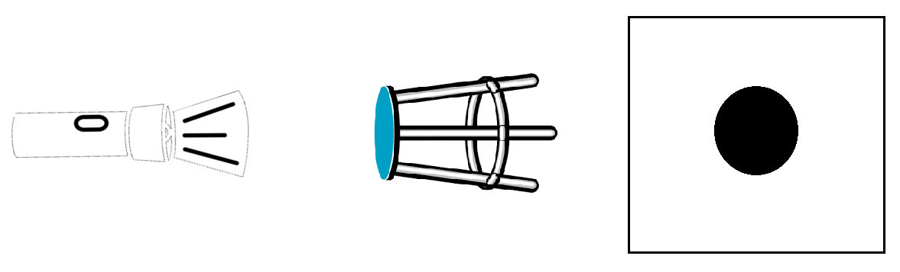
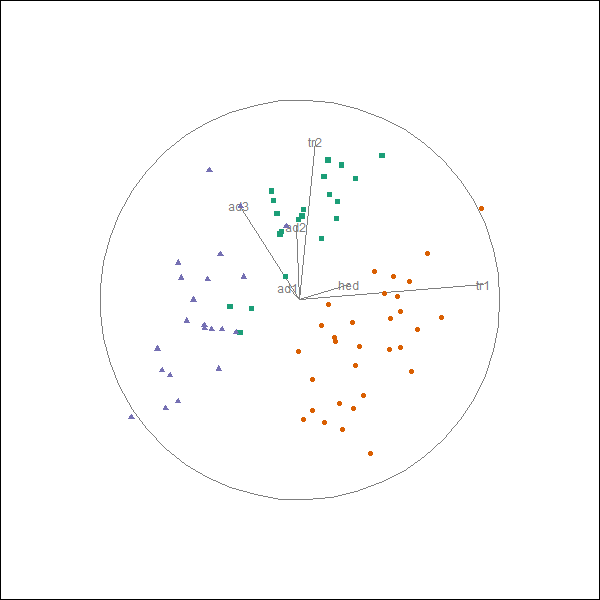
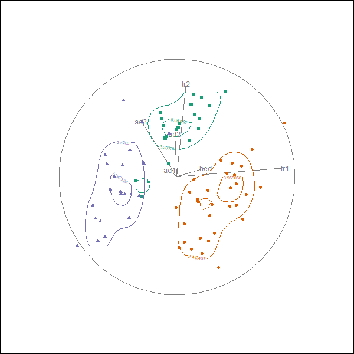

```{r setup, include=FALSE}
knitr::opts_chunk$set(
  eval       = TRUE,   # R code 
  echo       = FALSE,  # code
  include    = TRUE,   # plots
  results    = "asis", # text 'markup' 'asis' 'hold' 'hide'
  message    = FALSE,
  warning    = FALSE,
  error      = FALSE,
  cache      = FALSE,
  collapse   = TRUE,
  comment    = "",
  fig.height = 3,
  fig.width  = 7,
  fig.align  = "center"
  #fig.show = "hold",
  #strip.white = TRUE,
)

# library(spinifex) #interferes with ggplot2?! load before ggplot2
# library(tourr)
# library(Rtsne)
# library(tibble)
# library(ggplot2)
# library(ggthemes)
# library(magrittr)
# #library(gridExtra)
```
<!--  -->

# Overview

- Touring
- Analogy
- Touring typology
- Hole tour
- Manual tours (3 slides)
- Refrences
- Appendix

---
# Touring

- Linear dimensionality reduction, embedding a $p$-dim data object into a $d$-dim subspace, where:
    - $p$, dimensions (numeric variables) of the data, $x \in \mathbb{R}^p$
    - $d$, dimensions of the subset embedding, $d \leq p, \mathbb{R}^d \in \mathbb{R}^p$
    - embeddings are orthgonal projections (linear algebra)
- Let $d = 2$
    - The linear combinations of the variables give us an orientation to project down to 2 dimensions
    - Replicate this process for many 2-dimensional embeddings, making small changes to the linear combinations of variables
    - Plot the embeddings gives an animation as the data rotates in $p$-space

---
# Analogy - shadow puppets

- Imaging a bar stool in front of a light casting only a circle
- Rotation reveals the 3D shape



- Same visual interpretation that we want to preserve in visualizing in multivariate datasets *(Wickham et. al. 2015)*

---
# Touring typology

- Random choice - "grand tour" random forest walk in $p$-space *(Asimov 1985)*
- Precomputed choice - eg. "little tour" step through increments of all variables in order *(McDonald 1982)*
- Data driven - "guided tour" stochastic gradent descent on objective function *(Hurley & Buja 1990)*
- Manual choice - **"manual tour"** selecting a variable and manipulation *(Cook & Buja 1997)*
    - R implementation via the package `spinifex`, available on [github](https://github.com/nspyrison/spinifex)
    `devtools::install_github("nspyrison/spinifex")`

<br>
For more detail see Buja et al. 2005
<br>
Random, precomputed, and data-driven implemented in R `tourr` package, available on CRAN *(Wickham et. al. 2011)*

---
# Holes tour

Example of a guided tour from `tourr`:



---
# Manual Tours (1/3)

As described by Cook & Buja in 1997:

- Data, $x_{[n, p]}$, where $n$ is observations, $p$ is numeric variables (a dimension)
    - For ease of comuptation, we'll set this aside
- Basis, $b_{[p, d]}$, an orthonormal matrix mapping the linnear combinations of $p$ dimensions down to $d$ dimensional space. Essentially the angle the projector hits the $p$-dim data
- Choose a manip variable, $k$
- Let $e_{[p, 1]}, be a zero column vector with the $k$-th element set to 1
- Let manipulation space, $m_{[p, d+1]} = b||e$

---
# Manual Tours (2/3)

- Let rotation matrix, $r_{[d+1, d+1]}$, where:
    - $\theta$ is the angle of rotation within the basis plane
    - $\phi$ is the angle of rotation out of the basis plane
    - If $d = 2$, then $r_{[3, 3]} =$

$$
\begin{matrix}
		c_\theta^2 c_\phi + s_\theta^2 & -c_\theta s_\theta (1-c_\phi) & -c_\theta s_\phi \\ %line 1
		-c_\theta s_\theta & s_\theta^2 c_\phi + c_\theta^2 & -s_\theta s\phi \\ %line 2
		c_\theta s_\phi & s_\theta s_\phi & c_\phi \\ %line 3
\end{matrix}
$$

- Rotate manipulation space $rm_{[p, d+1]} = m_{[p, d+1]} * r_{[d+1, d+1]}$ be a rotated manipulation space
    - The first $d$ dimensions of $rm$ is the map to our lower dimensonial embeding (shadow)
- Project our data $p_{[n, d+1]} = x_{[n, p]} * rm_{[p, d+1]}$

---
# Manual Tours (3/3)

- One frame or slide, projecting $p$-dim data into $d$-space
- Rinse and repeat making small changes to $\phi$, we create an animation of our $d$-dim shadow as we rotate the data

```{r}
library(spinifex)
data(wine) # 178 obs, 14 var.
wine_std <- tourr::rescale(wine[, -14]) # without type of grape
rb <- tourr::basis_random(n = ncol(wine_std))

(mySlideshow <- spinifex(data = wine_std, basis = rb, 
                         manip_var = 1, n_slides = 50))
```

---
# References (1/2)

In order of appearance:

- Wickham, H., Cook, D., & Hofmann, H. (2015). Visualizing statistical models: Removing the blindfold: Visualizing Statistical Models. Statistical Analysis and Data Mining: The ASA Data Science Journal, 8(4), 203-225. https://doi.org/10.1002/sam.11271
- Buja, A., Cook, D., Asimov, D., & Hurley, C. (2005). Computational Methods for High-Dimensional Rotations in Data Visualization. In Handbook of Statistics (Vol. 24, pp. 391-413). Elsevier. https://doi.org/10.1016/S0169-7161(04)24014-7
- Asimov, D. (1985). The grand tour: a tool for viewing multidimensional data. SIAM Journal on Scientific and Statistical Computing, 6(1), 128-143.
- McDonald, J. A. (1982). INTERACTIVE GRAPHICS FOR DATA ANALYSIS.

---
# References (2/2)

- Hurley, C., & Buja, A. (1990). Analyzing High-Dimensional Data with Motion Graphics. SIAM Journal on Scientific and Statistical Computing, 11(6), 1193-1211. https://doi.org/10.1137/0911068
- Cook, D., & Buja, A. (1997). Manual Controls for High-Dimensional Data Projections. Journal of Computational and Graphical Statistics, 6(4), 464-480. https://doi.org/10.2307/1390747
- Wickham, H., Cook, D., Hofmann, H., & Buja, A. (2011). tourr???: An R Package for Exploring Multivariate Data with Projections. Journal of Statistical Software, 40(2). https://doi.org/10.18637/jss.v040.i02
- R Core Team (2018). R: A language and environment for statistical computing. R Foundation for

---
# Appendix (2/3)

`tourr::animate_groupxy()`


available on github: `devtools::install_github("nspyrion/tourr")`

---
# Appendix (2/3)

`tourr::animate_groupxy()`


available on github: `devtools::install_github("nspyrion/tourr")`

---
# Appendix (3/3)

`tourr::animate_density2d()`



available on github: `devtools::install_github("nspyrion/tourr")`
